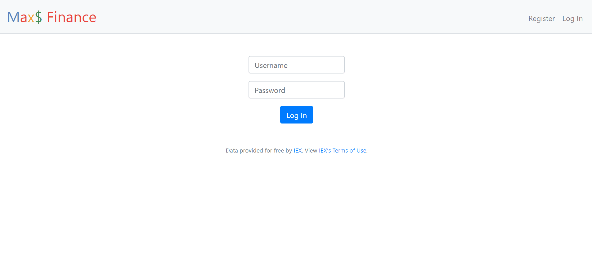

 APP NAME: CS50 FINANCE 
 CATEGORY:  Full Stack Software Engineering  
 TECHNOLOGICAL STACK: FLASK + BOOTSTRAP + SQL 
 LIVE DEMO: https://finance.cs50.net/  
 DESIGN: Provided by Harvard CS50  
 DESCRIPTION:
 This application uses Python, HTML and styling with Bootstrap. It also uses [IEX API](https://iexcloud.io/) to get the stocks values in real time and a SQL database to store users information, such as username, a hash of the password, the stocks they bought or sold and the history. It also stores cookies.

 END RESULT: (credit to gif owner goes to github.com/maxwelldemaio)
 